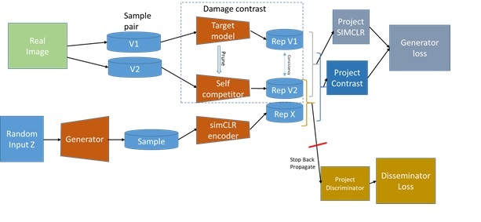

# Extensions to ContraD package supporting damage GAN and imbalance dataset 

This repository contains the code for reproducing the paper:
** Do we need a new generative model? A practical comparison between VAE and GANs variants Sydney university Capstone CS48-2 ** 
by Yanbing Liu, yliu6286@uni.sydney.edu.au, Yuqing Chen, yche4082@uni.sydney.edu.au, Tianyu Wang, twan8010@uni.sydney.edu.au, Xintong Chu,xchu5428@uni.sydney.edu.au
Moyang Chen,  mche5278@uni.sydney.edu.au, Ziheng Pan,  zpan0520@uni.sydney.edu.au, Robert Patience,  rpat3029@uni.sydney.edu.au


## Overview



*An overview of Contrastive Discriminator (ContraD).
In contraD the representation is not learned from the discriminator loss (L_dis), 
but from two contrastive losses (L+_con and L-_con), each is for the real and fake samples, respectively.
The damage GAN users the same approach but users pruning of the network to highlight minor features*

## Dependencies

Currently, the following environment has been confirmed to run the code:
* `python >= 3.6`
* `pytorch >= 1.6.0` (See [https://pytorch.org/](https://pytorch.org/) for the detailed installation)
* `tensorflow-gpu == 1.14.0` to run `test_tf_inception.py` for FID/IS evaluations
* Other requirements can be found in `environment.yml` (for conda users) or `environment_pip.txt` (for pip users)
```
#### Install dependencies via conda.
# The file also includes `pytorch`, `tensorflow-gpu=1.14`, and `cudatoolkit=10.1`.
# You may have to set the correct version of `cudatoolkit` compatible to your system.
# This command creates a new conda environment named `contrad`.
conda env create -f environment.yml

#### Install dependencies via pip.
# It assumes `pytorch` and `tensorflow-gpu` are already installed in the current environment.
pip install -r environment_pip.txt
```

### Preparing datasets

By default, the code assumes that all the datasets are placed under `data/`. 
You can change this path by setting the `$DATA_DIR` environment variable.

**CIFAR-10/100** can be automatically downloaded by running any of the provided training scripts.   

The structure of `$DATA_DIR` should be roughly like as follows:   
```
$DATA_DIR
├── cifar-10-batches-py   # CIFAR-10

```

## Scripts

### Training Scripts

We provide training scripts to reproduce the results in `train_*.py`, as listed in what follows:

| File | Description |
| ------ | ------ |
| [train_gan.py](train_gan.py) |  Train a GAN model other than StyleGAN2. DistributedDataParallel supported. |


The samples below demonstrate how to run each script to train GANs with ContraD.
One can modify `CUDA_VISIBLE_DEVICES` to further specify GPU number(s) to work on.

```
# SNDCGAN + ContraD on CIFAR-10
CUDA_VISIBLE_DEVICES=0 python train_gan.py configs/gan/cifar10/c10_b512.gin sndcgan \
--mode=contrad --aug=simclr --use_warmup

```
### Experiments CIFAR-10 using train_gan.py (parameter lists as shown in json format can be convert direct to python cmd lines)
```
# G: SNDCGAN / D: SNDCGAN /Loss:BCEL (full dataset, balanced, imbalanced )
["configs/gan/cifar10/c10_b512.gin", "snresnet18", "--mode=contrad","--aug=simclr","--use_warmup"] // CD_FL
["configs/gan/cifar10/c10_b512.gin", "snresnet18", "--mode=contrad","--aug=simclr","--use_warmup","--imbalance","--trainSplit=split1_D_b.npy"] // CD_PR
["configs/gan/cifar10/c10_b512.gin", "snresnet18", "--mode=contrad","--aug=simclr","--use_warmup","--imbalance","--trainSplit=split1_D_i.npy"] // CD_IM
# G: SNDCGAN / D: SNResNet-18 /Loss:simclr 
["configs/gan/cifar10/c10_b512.gin", "snresnet18", "--mode=contrad","--aug=simclr","--use_warmup"] // CD_FL
["configs/gan/cifar10/c10_b512.gin", "snresnet18", "--mode=contrad","--aug=simclr","--use_warmup","--imbalance","--trainSplit=split1_D_b.npy"] // CD_PR
["configs/gan/cifar10/c10_b512.gin", "snresnet18", "--mode=contrad","--aug=simclr","--use_warmup","--imbalance","--trainSplit=split1_D_i.npy"] // CD_IM
# G: SNDCGAN / D: Pruned SNResNet-18 /Loss:dammage 
["configs/gan/cifar10/c10_b512.gin", "snresPrune", "--mode=damage","--aug=simclr","--use_warmup"] // CD_FL
["configs/gan/cifar10/c10_b512.gin", "snresPrune", "--mode=damage","--aug=simclr","--use_warmup","--imbalance","--trainSplit=split1_D_b.npy"] // CD_PR
["configs/gan/cifar10/c10_b512.gin", "snresPrune", "--mode=damage","--aug=simclr","--use_warmup","--imbalance","--trainSplit=split1_D_i.npy"] // CD_IM

```


### Testing Scripts
#### FID scores for all experiements
* The script test_gan_sample copy.py generates samples for the 9 experiements and puts them into the directory structure outline for FID
* The input directories need to be edited for the directories generated by the 9 experiement above. Example parameter,
  ```
  [ "logs/gan/", "--n_samples=10000"]
  ```
* To create FID score of all samples. The cmd above has generated SAMPLE_ROOT/["DC_FL","DC_IM","DC_PR","CD_FL","CD_IM","CD_PR","DM_FL","DM_IM","DM_PR"] /img   
* Then test_tf_inception_experiments.py (parameter SAMPLE_ROOT, STATS) Example parameters:
  ```
  [ "/mnt/e/5704_testcase","third_party/fid/cifar10_stats.npz"] 
  ```
  will load each sample set and create log of FID and inception of all experiments

#### FID scores for major and minor imbalance class
* The script [test_lineval.py](test_lineval.py) performs linear evaluation for a given 
  pre-trained discriminator model stored at `model_path`:
  ```
  CUDA_VISIBLE_DEVICES=0 python test_lineval.py PATH/TO/D.pt sndcgan
  ```
   example parameters [ "logs/gan/c10_b512/snresnet18/contrad_simclr_L1.0_T0.1/9950/dis.pt",  "snresnet18"]
   
* Use the linear evaluator to move the samples from experiement/ to experiement_Class/[0,...9] using test_read_classify_samples.py
parameters  ( SAMPLE_ROOT, linear eval directory, linear eval wieghts). Examples parameters:

[ "/mnt/e/5704_testcase", "logs/gan/c10_b512X/sndcgan/contrad_simclr/DC_CD_FL","logs/gan/c10_b512X/sndcgan/contrad_simclr/DC_CD_FL/lin_eval_3169.pth.tar",  "sndcgan"]

* Finally manually combine the minor and major class in experiement_Class/[Max,Min] 
* Then rerun test_tf_inception_experiments.py with different parameter for FID scores of the min and max class
  ```
  [ "/mnt/e/5704_testcase","third_party/fid/cifar10_stats.npz","--verbose","--MinMax","--n_imgs=100"] 

  


